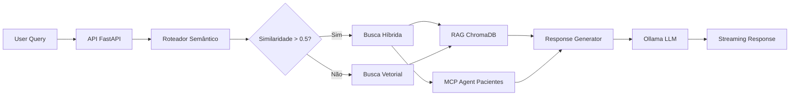

# 🏥 Assistente Médico Virtual - Tech Challenge (PoC)

Este repositório contém os artefatos da Prova de Conceito (PoC) para a criação de um assistente virtual focado em protocolos médicos. 

Durante o desenvolvimento deste projeto, realizamos o treinamento de um modelo de linguagem (LLM) próprio, aplicando *Fine-Tuning* (LoRA) sobre o modelo base Mistral 7B.

---

## 🏗️ Arquitetura do Sistema

O assistente médico implementa uma arquitetura inteligente baseada em **RAG (Retrieval-Augmented Generation)** com **roteamento semântico adaptativo** para otimizar custos e performance.

### 🔄 Roteador Âncora Semântica

O sistema utiliza um **roteador semântico** que analisa a similaridade das consultas para decidir qual estratégia de busca usar:

- **🎯 Threshold Inteligente**: Consultas com similaridade **> 0.5** ativam busca híbrida (RAG + MCP)
- **💡 Economia de Recursos**: Consultas com similaridade **≤ 0.5** usam apenas RAG vetorial
- **⚡ Otimização Automática**: Reduz requests desnecessários ao MCP Server e economiza tokens

### 🔍 Estratégias de Busca

1. **Busca Híbrida** (Alta similaridade):
   - **RAG**: Busca vetorial em protocolos médicos (ChromaDB)
   - **MCP**: Consulta dados específicos de pacientes via Model Context Protocol
   - **Integração**: Resposta personalizada combinando protocolo + contexto do paciente

2. **Busca Vetorial** (Baixa similaridade):
   - **RAG Puro**: Consulta apenas protocolos médicos gerais
   - **Performance**: Resposta rápida sem overhead de consultas externas
   - **Eficiência**: Ideal para perguntas genéricas sobre protocolos

### 🧠 Inteligência do Sistema

- **Análise Semântica**: Identifica automaticamente se a consulta refere-se a um paciente específico
- **Contexto Dinâmico**: Adapta a resposta baseada nos dados disponíveis
- **Guardrails Médicos**: Sempre mantém diretrizes de segurança independente da estratégia

---

## 📂 Estrutura do Projeto (Reprodutibilidade)

Todo o processo de treinamento e preparação dos dados foi rigorosamente documentado para a banca avaliadora e pode ser encontrado nas seguintes pastas:

* **`/data`**: Contém o dataset base utilizado para ensinar os protocolos médicos ao modelo.
* **`/jupyter`**: Contém os notebooks com o passo a passo completo do projeto de *Fine-Tuning* (limpeza de dados, configuração do Unsloth, treinamento LoRA, geração do modelo e testes locais).
* **`/app`**: Contém a aplicação completa do assistente médico com arquitetura em microserviços.

### 🏗️ Estrutura da Aplicação (/app)

A pasta `/app` contém toda a arquitetura do sistema de assistente médico, organizada em microserviços:

#### **📋 Componentes Principais:**

1. **`/app/api/`** - **API Principal (FastAPI)**
   - **LangGraph** para orquestração de workflows médicos inteligentes
   - **Roteador Semântico**: Decisão automática entre busca híbrida ou vetorial
   - **RAG (Retrieval-Augmented Generation)** com ChromaDB para protocolos
   - **MCP Integration**: Consulta dinâmica de dados de pacientes quando necessário
   - **Streaming em tempo real** de respostas médicas personalizadas
   - **Guardrails de segurança** médicos (nunca prescreve medicamentos)
   - **Otimização de custos**: Threshold inteligente para economizar requests

2. **`/app/mcp-server/`** - **MCP Server (Model Context Protocol)**
   - Servidor especializado em dados específicos de pacientes
   - **Ferramentas MCP**: Busca por CPF, RG, nome e ID de pacientes
   - **Ativação condicional**: Consultado apenas quando threshold semântico é atingido
   - **Mock database** com dados sintéticos realistas de pacientes
   - **API REST** otimizada para integração com roteador semântico

#### **🔗 Integração dos Serviços:**

- **API FastAPI** (porta 3030): Interface principal do assistente médico
- **MCP Server** (porta 8000): Fornece dados de pacientes via protocol MCP
- **ChromaDB** (porta 8001): Base vetorial de protocolos médicos
- **Ollama** (host): LLM para geração de respostas médicas

---

## 🐳 Como rodar o projeto completo (Docker)

Para executar a aplicação completa com todos os serviços necessários via Docker:

### Pré-requisitos
- Docker e Docker Compose instalados
- **Ollama rodando localmente** na porta 11434 (para LLM)
- Portas disponíveis: 3030 (API), 8000 (MCP), 8001 (ChromaDB)

### Executando o projeto

**1. Clone o repositório e navegue até a pasta raiz**
```bash
cd medical-assistant
```

**2. Configure o Ollama localmente (se ainda não estiver rodando)**
```bash
# Instalar Ollama: https://ollama.ai
# Baixar modelo LLM (exemplo)
ollama pull llama3.1
ollama pull bge-m3  # Para embeddings
```

**3. Construa e inicie todos os serviços**
```bash
docker-compose build --no-cache
docker-compose up -d
```

**4. Verifique se os serviços estão funcionando**
```bash
docker-compose ps
```

### 🌐 Acessando os serviços

- **🏥 API Principal**: http://localhost:3030/
- **📊 Health Check API**: http://localhost:3030/health/chroma
- **🔍 MCP Server**: http://localhost:8000/ (ferramentas de pacientes)
- **🗄️ ChromaDB**: http://localhost:8001/ (base vetorial)

### 🧪 Testando o Roteador Semântico

**Busca Híbrida (ativará MCP + RAG):**
```bash
curl -X POST "http://localhost:3030/medical/query/complete" \
  -H "Content-Type: application/json" \
  -d '{
    "query": "Qual o histórico do paciente João da Silva?",
    "user_id": "medico_001"
  }'
```

**Busca Vetorial (apenas RAG):**
```bash
curl -X POST "http://localhost:3030/medical/query/complete" \
  -H "Content-Type: application/json" \
  -d '{
    "query": "Quais são os protocolos para hipertensão?",
    "user_id": "enfermeiro_001"
  }'
```

### 🔧 Comandos úteis para desenvolvimento

**Ver logs da API:**
```bash
docker-compose logs api -f
```

**Ver logs do MCP Server:**
```bash
docker-compose logs mcp-server -f
```

**Ver logs do ChromaDB:**
```bash
docker-compose logs chroma -f
```

**Parar todos os serviços:**
```bash
docker-compose down
```

**Rebuild completo após mudanças no código:**
```bash
docker-compose down
docker-compose build --no-cache
docker-compose up -d
```

**Rebuild apenas da API:**
```bash
docker-compose build --no-cache api
docker-compose restart api
```

### 🏗️ Arquitetura dos Serviços

1. **🏥 API FastAPI** (port 3030):
   - Interface principal do assistente médico
   - **LangGraph** para workflows inteligentes
   - **Streaming de respostas** em tempo real
   - **Guardrails médicos** rigorosos
   - **Injeção de dependências** para escalabilidade

2. **🗄️ ChromaDB** (port 8001):
   - Base vetorial de protocolos médicos
   - **RAG (Retrieval-Augmented Generation)**
   - Embeddings para busca semântica
   - Persistência de dados vetorizados

3. **🔍 MCP Server** (port 8000):
   - **Model Context Protocol** para dados de pacientes
   - Ferramentas especializadas: `patient_by_cpf`, `patient_by_name`, etc.
   - Mock database com dados sintéticos
   - API REST para consultas dinâmicas

4. **🧠 Ollama** (host system):
   - LLM local para geração de respostas
   - Suporte a múltiplos modelos
   - Integração via `host.docker.internal`

### 🔗 Fluxo de Integração



**Fluxo Detalhado:**
1. **Query Analysis**: Roteador analisa similaridade semântica com padrões conhecidos
2. **Threshold Decision**: Se similaridade > 0.5 → Busca Híbrida, senão → RAG Puro  
3. **Resource Optimization**: Economiza requests ao MCP e tokens do LLM
4. **Context Integration**: Combina protocolos + dados do paciente (quando aplicável)
5. **Intelligent Response**: Resposta personalizada via streaming

---

## �🚀 Como rodar o experimento treinado localmente

Caso deseje testar o modelo que foi treinado com os dados do hospital, ele foi exportado para o formato leve `.gguf` para rodar de forma otimizada via **Ollama** usando processamento de CPU/GPU unificada.

### ⚠️ Pré-requisito: Executar os Notebooks

**IMPORTANTE**: Para gerar o modelo `.gguf` exportado, você deve executar os notebooks do Jupyter na seguinte ordem:

1. **`dataset.ipynb`** - Preparação e limpeza dos dados
2. **`finetuning.ipynb`** - Treinamento do modelo com LoRA
3. **`export_gguf.ipynb`** - Exportação do modelo treinado para formato `.gguf`

Somente após executar todos os notebooks nesta sequência, o arquivo `mistral-7b-v0.3.Q4_K_M.gguf` estará disponível para uso com o Ollama.

### Passo a passo para usar o modelo exportado:

**1. Acesse a pasta dos modelos**
Pelo seu terminal, navegue até o diretório onde o arquivo `.gguf` exportado e o `Modelfile` estão salvos:
```bash
cd models
```

**2. Construa o modelo no Ollama**
Utilize o comando abaixo para que o Ollama leia a "receita" do Modelfile, importe os pesos do .gguf e crie a imagem do modelo no seu sistema. Vamos chamá-lo de `assistente_postech`:

```bash
ollama create assistente_postech -f Modelfile
```

(Aguarde até a mensagem de success aparecer no terminal).

**3. Teste o modelo no terminal**
Para interagir com o modelo treinado diretamente pela linha de comando, execute:
```bash
ollama run assistente_postech
```