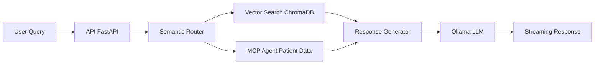

# 🏥 Assistente Médico Virtual - Tech Challenge (PoC)

Este repositório contém os artefatos da Prova de Conceito (PoC) para a criação de um assistente virtual focado em protocolos médicos. 

Durante o desenvolvimento deste projeto, realizamos o treinamento de um modelo de linguagem (LLM) próprio, aplicando *Fine-Tuning* (LoRA) sobre o modelo base Mistral 7B.

---

## 🏗️ Decisão Arquitetural: O uso do modelo treinado

Embora o *fine-tuning* tenha sido realizado e validado com sucesso, **optamos por não utilizar o modelo treinado na aplicação que utiliza os grafos deste projeto.**

**Por quê?**
Por questões de processamento e flexibilidade da arquitetura. Ao passar pelo *fine-tuning* focado estritamente no formato de instrução direta (Text-to-Text), o modelo tornou-se "pequeno" e excessivamente especializado. 

A nossa arquitetura final desejada exige capacidades avançadas de *Retrieval-Augmented Generation* (RAG) e *Tool Calling* para consultar sistemas e documentos dinâmicos do hospital em tempo real. Testes empíricos demonstraram que o modelo base puro possui maior "fôlego cognitivo" para ler grandes blocos de contexto injetados via RAG sem sofrer de vício de formato (*overfitting* de prompt). 

O modelo treinado foi mantido no projeto como um artefato de pesquisa e para demonstração da técnica de aprendizado de máquina.

---

## 📂 Estrutura do Projeto (Reprodutibilidade)

Todo o processo de treinamento e preparação dos dados foi rigorosamente documentado para a banca avaliadora e pode ser encontrado nas seguintes pastas:

* **`/data`**: Contém o dataset base utilizado para ensinar os protocolos médicos ao modelo.
* **`/jupyter`**: Contém os notebooks com o passo a passo completo do projeto de *Fine-Tuning* (limpeza de dados, configuração do Unsloth, treinamento LoRA, geração do modelo e testes locais).
* **`/app`**: Contém a aplicação completa do assistente médico com arquitetura em microserviços.

### 🏗️ Estrutura da Aplicação (/app)

A pasta `/app` contém toda a arquitetura do sistema de assistente médico, organizada em microserviços:

#### **📋 Componentes Principais:**

1. **`/app/api/`** - **API Principal (FastAPI)**
   - Arquitetura em camadas com injeção de dependências
   - **LangGraph** para orquestração de workflows médicos
   - **RAG (Retrieval-Augmented Generation)** com ChromaDB
   - **Streaming em tempo real** de respostas médicas
   - **Guardrails de segurança** (nunca prescreve medicamentos)
   - **Roteamento semântico** inteligente (hybrid vs vector search)

2. **`/app/mcp-server/`** - **MCP Server (Model Context Protocol)**
   - Servidor especializado em dados de pacientes
   - **Ferramentas MCP** para busca por CPF, RG, nome e ID
   - **Mock database** com dados sintéticos de pacientes
   - **API REST** para integração com o assistente médico

#### **🔗 Integração dos Serviços:**

- **API FastAPI** (porta 3030): Interface principal do assistente médico
- **MCP Server** (porta 8000): Fornece dados de pacientes via protocol MCP
- **ChromaDB** (porta 8001): Base vetorial de protocolos médicos
- **Ollama** (host): LLM para geração de respostas médicas

---

## 🐳 Como rodar o projeto completo (Docker)

Para executar a aplicação completa com todos os serviços necessários via Docker:

### Pré-requisitos
- Docker e Docker Compose instalados
- **Ollama rodando localmente** na porta 11434 (para LLM)
- Portas disponíveis: 3030 (API), 8000 (MCP), 8001 (ChromaDB)

### Executando o projeto

**1. Clone o repositório e navegue até a pasta raiz**
```bash
cd medical-assistant
```

**2. Configure o Ollama localmente (se ainda não estiver rodando)**
```bash
# Instalar Ollama: https://ollama.ai
# Baixar modelo LLM (exemplo)
ollama pull llama3.1
ollama pull bge-m3  # Para embeddings
```

**3. Construa e inicie todos os serviços**
```bash
docker-compose build --no-cache
docker-compose up -d
```

**4. Verifique se os serviços estão funcionando**
```bash
docker-compose ps
```

### 🌐 Acessando os serviços

- **🏥 API Principal**: http://localhost:3030/
- **📊 Health Check API**: http://localhost:3030/health/chroma
- **🔍 MCP Server**: http://localhost:8000/ (ferramentas de pacientes)
- **🗄️ ChromaDB**: http://localhost:8001/ (base vetorial)

### 🧪 Testando os endpoints médicos

**Consulta completa (JSON estruturado):**
```bash
curl -X POST "http://localhost:3030/medical/query/complete" \
  -H "Content-Type: application/json" \
  -d '{
    "query": "Quais protocolos para dor torácica?",
    "user_id": "medico_001"
  }'
```

**Consulta com streaming:**
```bash
curl -X POST "http://localhost:3030/medical/query" \
  -H "Content-Type: application/json" \
  -d '{
    "query": "Como proceder com choque anafilático?",
    "user_id": "enfermeiro_001"
  }' \
  --no-buffer
```

### 🔧 Comandos úteis para desenvolvimento

**Ver logs da API:**
```bash
docker-compose logs api -f
```

**Ver logs do MCP Server:**
```bash
docker-compose logs mcp-server -f
```

**Ver logs do ChromaDB:**
```bash
docker-compose logs chroma -f
```

**Parar todos os serviços:**
```bash
docker-compose down
```

**Rebuild completo após mudanças no código:**
```bash
docker-compose down
docker-compose build --no-cache
docker-compose up -d
```

**Rebuild apenas da API:**
```bash
docker-compose build --no-cache api
docker-compose restart api
```

### 🏗️ Arquitetura dos Serviços

1. **🏥 API FastAPI** (port 3030):
   - Interface principal do assistente médico
   - **LangGraph** para workflows inteligentes
   - **Streaming de respostas** em tempo real
   - **Guardrails médicos** rigorosos
   - **Injeção de dependências** para escalabilidade

2. **🗄️ ChromaDB** (port 8001):
   - Base vetorial de protocolos médicos
   - **RAG (Retrieval-Augmented Generation)**
   - Embeddings para busca semântica
   - Persistência de dados vetorizados

3. **🔍 MCP Server** (port 8000):
   - **Model Context Protocol** para dados de pacientes
   - Ferramentas especializadas: `patient_by_cpf`, `patient_by_name`, etc.
   - Mock database com dados sintéticos
   - API REST para consultas dinâmicas

4. **🧠 Ollama** (host system):
   - LLM local para geração de respostas
   - Suporte a múltiplos modelos
   - Integração via `host.docker.internal`

### 🔗 Fluxo de Integração



---

## �🚀 Como rodar o experimento treinado localmente

Caso deseje testar o modelo que foi treinado com os dados do hospital, ele foi exportado para o formato leve `.gguf` para rodar de forma otimizada via **Ollama** usando processamento de CPU/GPU unificada.

### ⚠️ Pré-requisito: Executar os Notebooks

**IMPORTANTE**: Para gerar o modelo `.gguf` exportado, você deve executar os notebooks do Jupyter na seguinte ordem:

1. **`dataset.ipynb`** - Preparação e limpeza dos dados
2. **`finetuning.ipynb`** - Treinamento do modelo com LoRA
3. **`export_gguf.ipynb`** - Exportação do modelo treinado para formato `.gguf`

Somente após executar todos os notebooks nesta sequência, o arquivo `mistral-7b-v0.3.Q4_K_M.gguf` estará disponível para uso com o Ollama.

### Passo a passo para usar o modelo exportado:

**1. Acesse a pasta dos modelos**
Pelo seu terminal, navegue até o diretório onde o arquivo `.gguf` exportado e o `Modelfile` estão salvos:
```bash
cd models
```

**2. Construa o modelo no Ollama**
Utilize o comando abaixo para que o Ollama leia a "receita" do Modelfile, importe os pesos do .gguf e crie a imagem do modelo no seu sistema. Vamos chamá-lo de `assistente_postech`:

```bash
ollama create assistente_postech -f Modelfile
```

(Aguarde até a mensagem de success aparecer no terminal).

**3. Teste o modelo no terminal**
Para interagir com o modelo treinado diretamente pela linha de comando, execute:
```bash
ollama run assistente_postech
```